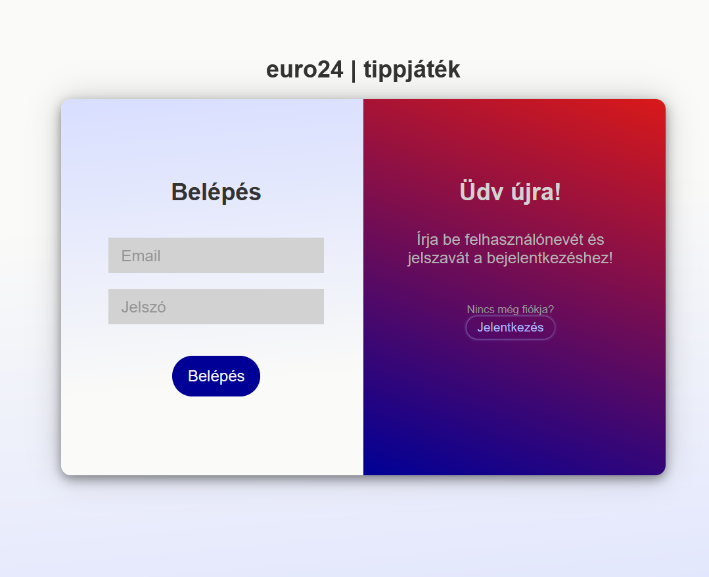
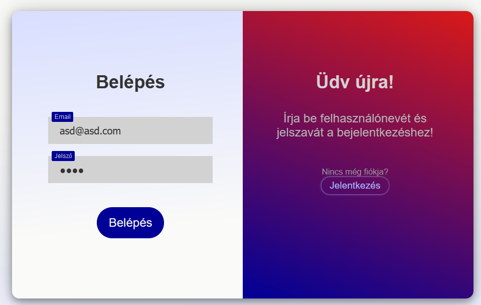
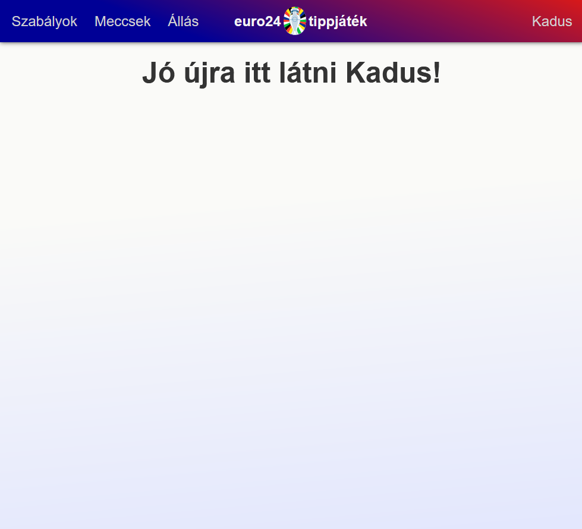
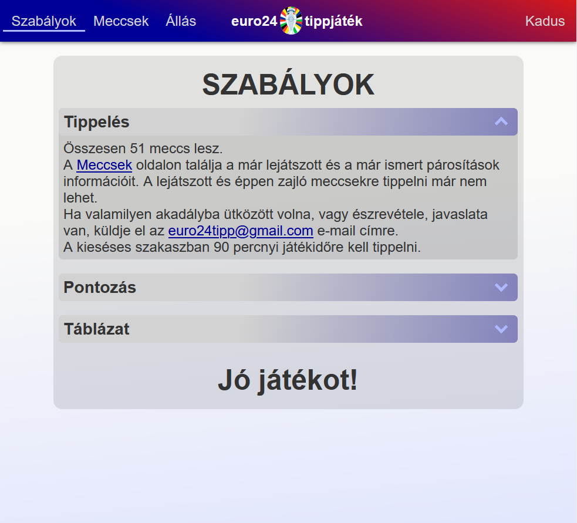
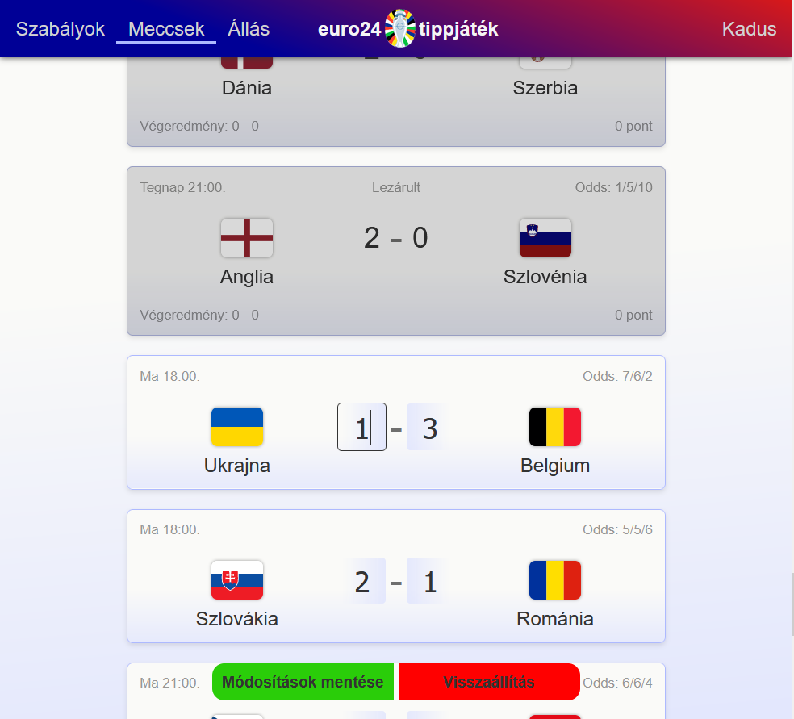
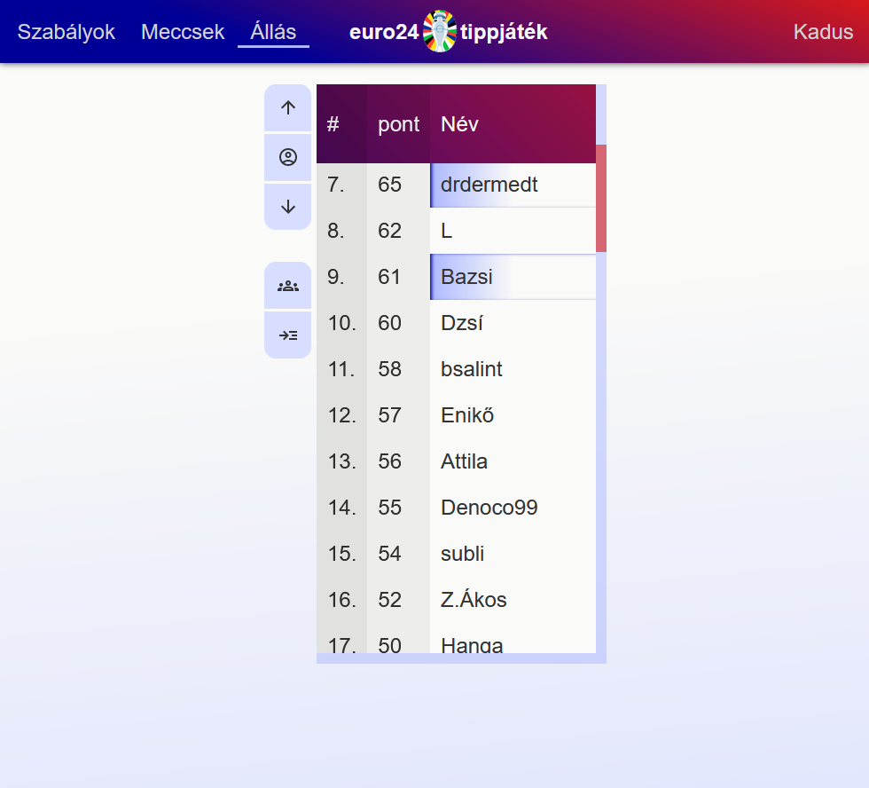
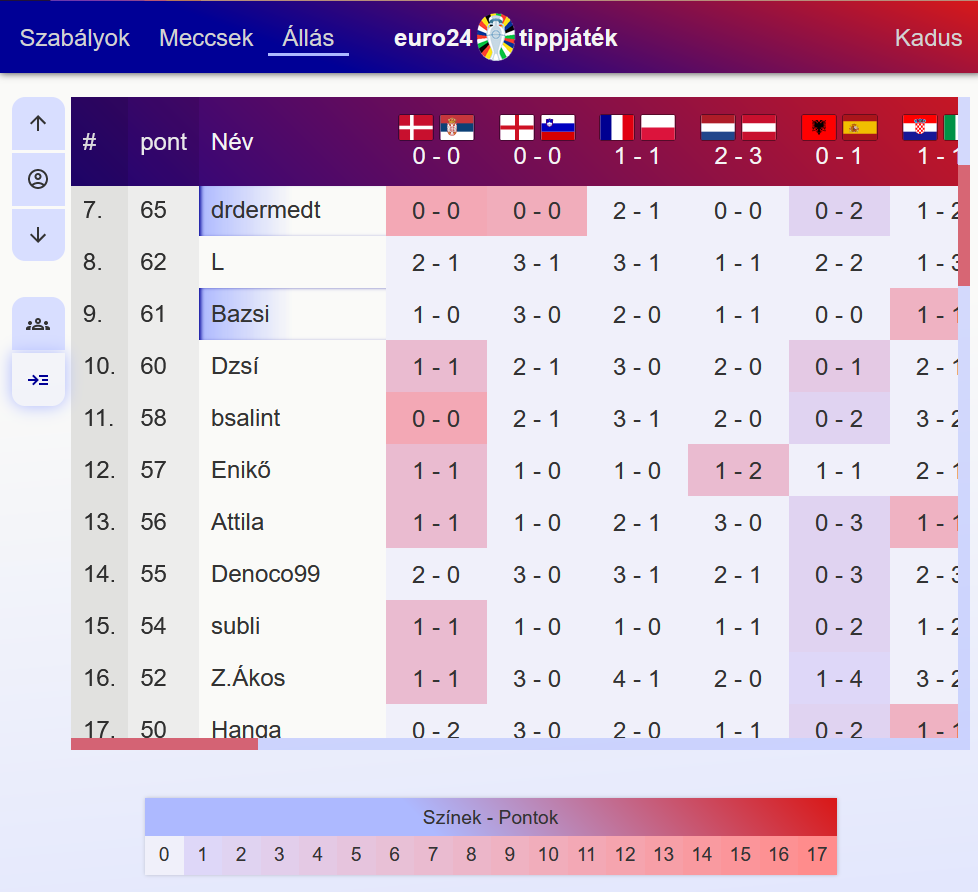
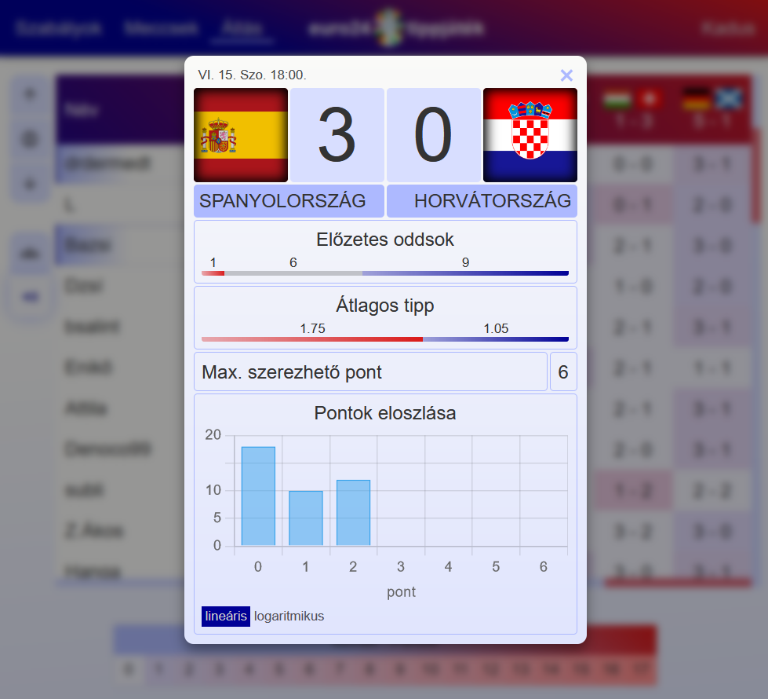

# Euro 24 tippjáték oldal
## Leírás

A projekt a 2024-es UEFA Európabajnokságra készült. A játék lényege eltalálni a meccsek pontos végkimenetelét és a jó tippekért pontokat gyűjteni.
A meccsekre kapott pontok függnek a meccs végkimenetelének előzetes esélyeitől, valamint a lőtt gólok számától.
Az oldal az alábbi linken érhető el: <https://hkadus.pythonanywhere.com>.
Vendég belépési adatok:
email: guest@guest.com
jelszó: guest

## Funkciók

### Felhasználók
- **Tippelés**: A "Meccsek" oldalon a felhasználók be tudják írni tippjeiket.
- **Állás**: Az összes felhasználó gyűjtött pontjai alapján felállított ranglista.
- **Tippek**: Minden felhasználó tippjeit (és az azokért járó pontokat) meg lehet nézni.
- **Követés**: Lehetséges más felhasználókat követni (egyirányú, a követett nem kap értesítést). Lehetséges csak a követettek tippjeit és ranglistáját megtekinteni.
- **Profil tevékenységek**: Be/Kijelentkezés, adatok módosítása (email, felhasználónév, jelszó).

### Admin
- **Felhasználók kezelése**: A játékra jelentkezőt elfogadása/elutasítása. A felvett jelentkezők automatikus emailt kapnak egy biztonságosan generált jelszóval.
- **Meccsek kezelése**: Meccsek automatikus frissítése (időpontok, új meccsek) egy API hívással.
- **Oddsok**: A meccsekre kapható plusz pontok frissítése valós fogadóirodák által adott oddsok alapján.

## Használt technológiák
- **Frontend**: JavaScript, Jinja (HTML), CSS. Külső könyvtárak nélkül.
- **Backend**: Python, Flask
- **Adatbázis**: SQLAlchemy, MySQL

## Megjegyzés
Az oldal [eredetijét](http://molnar-saska.hu/) Molnár-Sáska Zoltán, volt osztálytársam készítette. Az eredeti PHP-ban íródott, én ezt készítettem el teljesen nulláról a kódbázis ismerete nélkül, átgondolt megjelenéssel és funkciókkal.

## Média
### Login oldal

   
   

### Bejelentkezés után

   

### Szabályok oldal

   

### Meccsek oldal

   

### Állás oldal

   
   
   

